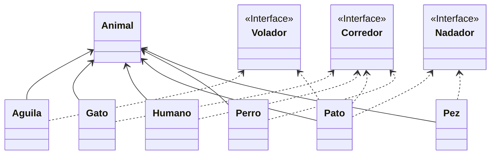

## Diagrama de clases - Animales

```mermaid
classDiagram
direction BT
class Aguila
class Animal
class Corredor {
<<Interface>>
}
class Gato
class Humano
class Nadador {
<<Interface>>
}
class Pato
class Perro
class Pez
class Volador {
<<Interface>>
}

Aguila  -->  Animal
Aguila  ..>  Volador
Gato  -->  Animal
Gato  ..>  Corredor
Humano  -->  Animal
Humano  ..>  Corredor
Pato  -->  Animal
Pato  ..>  Corredor
Pato  ..>  Nadador
Pato  ..>  Volador
Perro  -->  Animal
Perro  ..>  Corredor
Pez  -->  Animal
Pez  ..>  Nadador
```
