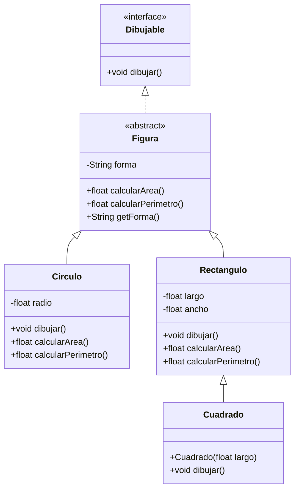

## Diagrama de clases - Figuras

```mermaid
classDiagram
direction TB

class Dibujable {
  <<interface>>
  +void dibujar()
}

class Figura {
  <<abstract>>
  -String forma
  +float calcularArea()
  +float calcularPerimetro()
  +String getForma()
}

class Circulo {
  -float radio
  +void dibujar()
  +float calcularArea()
  +float calcularPerimetro()
}

class Rectangulo {
  -float largo
  -float ancho
  +void dibujar()
  +float calcularArea()
  +float calcularPerimetro()
}

class Cuadrado {
  +Cuadrado(float largo)
  +void dibujar()
}

Dibujable <|.. Figura
Figura <|-- Circulo
Figura <|-- Rectangulo
Rectangulo <|-- Cuadrado
```
