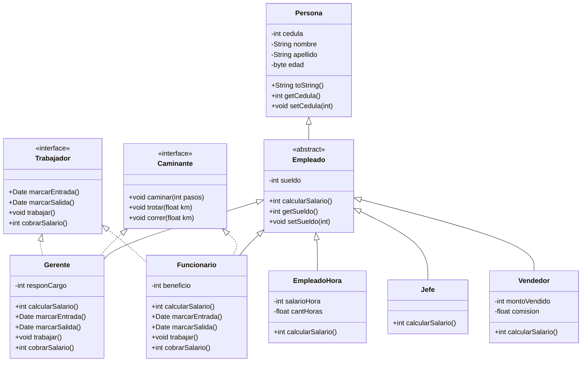

## Diagrama de clases - Personales

```mermaid
classDiagram
direction TB

class Caminante {
  <<interface>>
  +void caminar(int pasos)
  +void trotar(float km)
  +void correr(float km)
}

class Trabajador {
  <<interface>>
  +Date marcarEntrada()
  +Date marcarSalida()
  +void trabajar()
  +int cobrarSalario()
}

class Persona {
  -int cedula
  -String nombre
  -String apellido
  -byte edad
  +String toString()
  +int getCedula()
  +void setCedula(int)
}

class Empleado {
  <<abstract>>
  -int sueldo
  +int calcularSalario()
  +int getSueldo()
  +void setSueldo(int)
}

class EmpleadoHora {
  -int salarioHora
  -float cantHoras
  +int calcularSalario()
}

class Jefe {
  +int calcularSalario()
}

class Gerente {
  -int responCargo
  +int calcularSalario()
  +Date marcarEntrada()
  +Date marcarSalida()
  +void trabajar()
  +int cobrarSalario()
}

class Funcionario {
  -int beneficio
  +int calcularSalario()
  +Date marcarEntrada()
  +Date marcarSalida()
  +void trabajar()
  +int cobrarSalario()
}

class Vendedor {
  -int montoVendido
  -float comision
  +int calcularSalario()
}

Persona <|-- Empleado
Empleado <|-- EmpleadoHora
Empleado <|-- Jefe
Empleado <|-- Gerente
Empleado <|-- Funcionario
Empleado <|-- Vendedor
Caminante <|.. Gerente
Trabajador <|.. Gerente
Caminante <|.. Funcionario
Trabajador <|.. Funcionario
```
